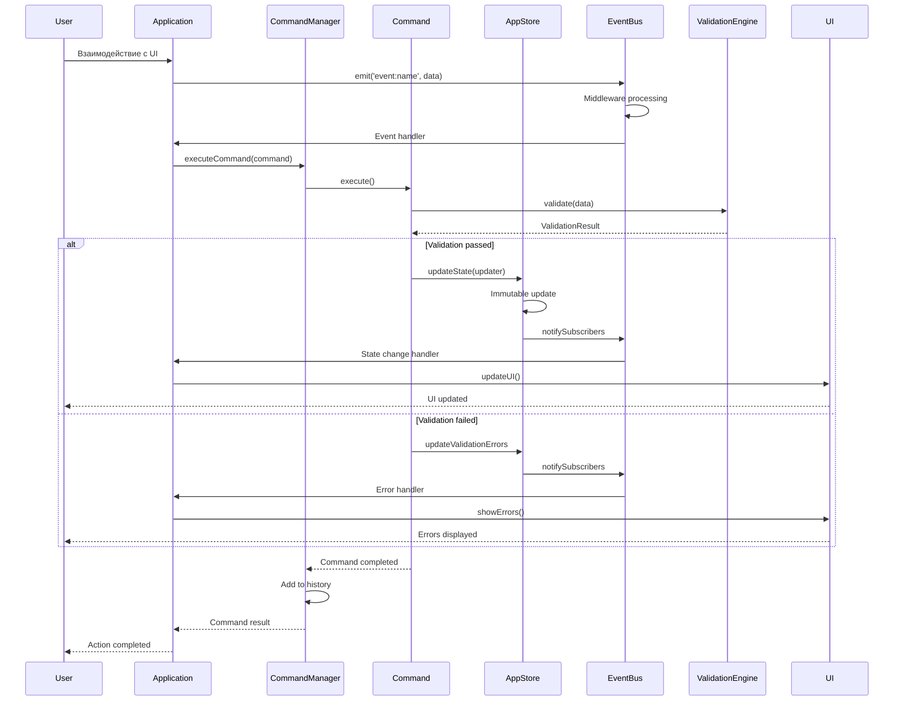
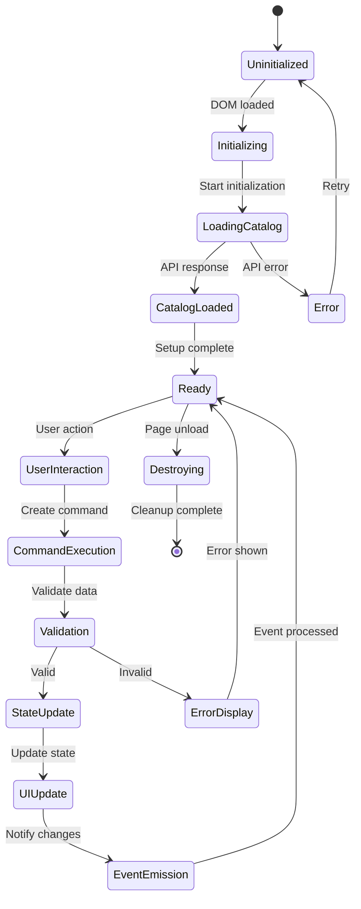
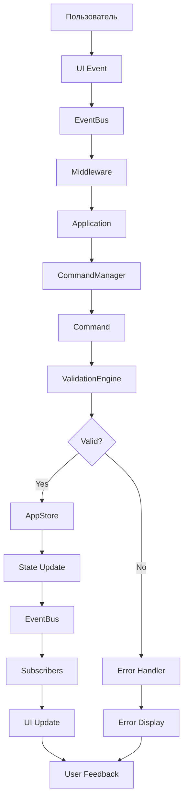

# Архитектура проекта Web-ларёк

## Диаграмма классов

```mermaid
classDiagram
    class Application {
        -commandManager: CommandManager
        -appStore: AppStore
        -eventBus: EventBus
        -validationEngine: ValidationEngine
        -isInitialized: boolean
        +initialize()
        +destroy()
        +getState()
        -setupEventHandlers()
        -subscribeToStateChanges()
        -updateUI()
        -updateBasketUI()
        -updateCatalogUI()
        -updateModalState()
        -showModalContent()
        -hideModalContent()
    }

    class CommandManager {
        -commands: Command[]
        -currentIndex: number
        -maxCommands: number
        +executeCommand(command)
        +undo()
        +redo()
        +canUndo()
        +canRedo()
        +getHistory()
        +clearHistory()
    }

    class Command~T~ {
        <<abstract>>
        #executed: boolean
        #data: T
        +execute()
        +undo()
        +redo()
        +canExecute()
        +getDescription()
        +getData()
        +isExecuted()
    }

    class AddToBasketCommand {
        +execute()
        +undo()
        +canExecute()
        +getDescription()
    }

    class RemoveFromBasketCommand {
        -removedItem: BasketItem
        +execute()
        +undo()
        +canExecute()
        +getDescription()
    }

    class UpdateOrderFieldCommand {
        -oldValue: string
        +execute()
        +undo()
        +canExecute()
        +getDescription()
    }

    class OpenModalCommand {
        +execute()
        +undo()
        +canExecute()
        +getDescription()
    }

    class CloseModalCommand {
        +execute()
        +undo()
        +canExecute()
        +getDescription()
    }

    class LoadCatalogCommand {
        +execute()
        +undo()
        +canExecute()
        +getDescription()
    }

    class ClearBasketCommand {
        -clearedItems: BasketItem[]
        -clearedTotal: number
        +execute()
        +undo()
        +canExecute()
        +getDescription()
    }

    class AppStore {
        -_state: AppStateData
        -subscribers: Map
        -subscriptionIdCounter: number
        +getState()
        +subscribe(callback, selector)
        +unsubscribe(id)
        +updateCatalog(updater)
        +updateBasket(updater)
        +updateOrder(updater)
        +updateUI(updater)
        +addNotification(notification)
        +removeNotification(id)
        -notifySubscribers(oldState)
        -updateState(updater)
    }

    class BaseState~T~ {
        <<abstract>>
        #_state: T
        #subscribers: Map
        #subscriptionIdCounter: number
        +getState()
        +subscribe(callback, selector)
        +unsubscribe(id)
        -notifySubscribers(oldState)
        #updateState(updater)
    }

    class EventBus {
        -handlers: Map
        -middleware: EventMiddleware[]
        -subscriptionIdCounter: number
        -eventHistory: EventMetadata[]
        -maxHistorySize: number
        +addMiddleware(middleware)
        +on(eventName, handler, priority)
        +once(eventName, handler, priority)
        +off(eventName, handlerId)
        +offAll(eventName)
        +emit(eventName, data, source, metadata)
        +getEventHistory()
        +clearEventHistory()
        +getSubscriberCount(eventName)
        +getEventNames()
        -executeMiddleware(event)
        -addToHistory(event)
    }

    class EventMiddleware {
        <<interface>>
        +name: string
        +execute(event, next)
    }

    class LoggingMiddleware {
        +name: string
        +execute(event, next)
    }

    class ValidationMiddleware {
        -validators: Map
        +name: string
        +addValidator(eventName, validator)
        +execute(event, next)
    }

    class ValidationEngine~T~ {
        -schema: ValidationSchema~T~
        -customValidators: Map
        +setSchema(schema)
        +addCustomValidator(name, validator)
        +validate(data)
        +validateField(fieldName, value, rules)
        +validateFields(fields)
        +isFieldValid(fieldName, value)
        +getFieldErrors(fieldName, value)
    }

    class Validators {
        <<static>>
        +required~T~(value)
        +minLength(min)
        +maxLength(max)
        +email()
        +phone()
        +range(min, max)
        +pattern(regex, message)
        +custom~T~(validator)
        +conditional~T~(condition, rule)
    }

    class OrderValidationSchema {
        <<static>>
        +create()
    }

    class ContactValidationSchema {
        <<static>>
        +create()
    }

    class ValidatorFactory {
        <<static>>
        +createOrderValidator()
        +createContactValidator()
        +createCustomValidator(schema)
    }

    %% Интерфейсы данных
    class AppStateData {
        <<interface>>
        +catalog: CatalogState
        +basket: BasketState
        +order: OrderState
        +ui: UIState
    }

    class CatalogState {
        <<interface>>
        +items: ProductItem[]
        +loading: boolean
        +error: string
    }

    class BasketState {
        <<interface>>
        +items: BasketItem[]
        +total: number
        +isOpen: boolean
    }

    class OrderState {
        <<interface>>
        +payment: string
        +address: string
        +email: string
        +phone: string
        +validation: ValidationState
        +lastOrderTotal: number
    }

    class UIState {
        <<interface>>
        +modal: ModalState
        +notifications: Notification[]
    }

    class ProductItem {
        <<interface>>
        +id: string
        +title: string
        +description: string
        +image: string
        +category: string
        +price: number
        +index: number
    }

    class BasketItem {
        <<interface>>
        +id: string
        +index: number
        +title: string
        +price: number
    }

    class ValidationState {
        <<interface>>
        +payment: string
        +address: string
        +email: string
        +phone: string
    }

    class ModalState {
        <<interface>>
        +isOpen: boolean
        +content: string
    }

    class Notification {
        <<interface>>
        +id: string
        +type: string
        +message: string
        +duration: number
        +timestamp: number
    }

    %% Связи
    Application --> CommandManager : uses
    Application --> AppStore : uses
    Application --> EventBus : uses
    Application --> ValidationEngine : uses

    CommandManager --> Command : manages
    Command <|-- AddToBasketCommand : extends
    Command <|-- RemoveFromBasketCommand : extends
    Command <|-- UpdateOrderFieldCommand : extends
    Command <|-- OpenModalCommand : extends
    Command <|-- CloseModalCommand : extends
    Command <|-- LoadCatalogCommand : extends
    Command <|-- ClearBasketCommand : extends

    BaseState <|-- AppStore : extends
    AppStore --> AppStateData : manages

    EventBus --> EventMiddleware : uses
    EventMiddleware <|.. LoggingMiddleware : implements
    EventMiddleware <|.. ValidationMiddleware : implements

    ValidationEngine --> Validators : uses
    ValidationEngine --> ValidationSchema : uses
    Validators --> ValidationRule : creates
    OrderValidationSchema --> ValidationSchema : creates
    ContactValidationSchema --> ValidationSchema : creates
    ValidatorFactory --> ValidationEngine : creates

    Application --> ValidationEngine : uses
    Command --> ValidationEngine : uses
```



## Диаграмма последовательности



## Диаграмма компонентов

```mermaid
graph TB
    subgraph "Архитектура приложения"
        subgraph "Application Layer"
            Application
        end

        subgraph "Command Layer"
            CommandManager
            Command
            AddToBasketCommand
            RemoveFromBasketCommand
            UpdateOrderFieldCommand
            OpenModalCommand
            CloseModalCommand
            LoadCatalogCommand
            ClearBasketCommand
        end

        subgraph "State Management Layer"
            AppStore
            BaseState
            AppStateData
        end

        subgraph "Event System Layer"
            EventBus
            EventMiddleware
            LoggingMiddleware
            ValidationMiddleware
        end

        subgraph "Validation Layer"
            ValidationEngine
            Validators
            OrderValidationSchema
            ContactValidationSchema
            ValidatorFactory
        end

        subgraph "Data Models"
            ProductItem
            BasketItem
            OrderState
            ValidationState
            Notification
        end
    end

    subgraph "UI Layer"
        UI
        Forms
        Components
    end

    %% Связи между слоями
    Application Layer --> Command Layer
    Application Layer --> State Management Layer
    Application Layer --> Event System Layer
    Application Layer --> Validation Layer
    Application Layer --> UI Layer

    Command Layer --> State Management Layer
    Command Layer --> Event System Layer
    Command Layer --> Validation Layer

    State Management Layer --> Event System Layer
    Event System Layer --> Validation Layer

    UI Layer --> Application Layer
```

## Диаграмма состояний



## Диаграмма потоков данных



## Архитектурные принципы

### 1. Событийная архитектура
- Все взаимодействия происходят через события
- Слабая связанность компонентов
- Легкое тестирование и отладка

### 2. Паттерн команд
- Каждое действие инкапсулировано в команду
- Поддержка отмены и повтора операций
- История выполненных действий

### 3. Централизованное состояние
- Единый источник истины
- Реактивные обновления UI
- Предсказуемые изменения состояния

### 4. Система валидации
- Гибкие схемы валидации
- Цепочка правил
- Пользовательские валидаторы

### 5. Middleware система
- Расширяемая обработка событий
- Логирование и мониторинг
- Валидация на уровне событий

## Преимущества архитектуры

1. **Масштабируемость** - легко добавлять новые функции
2. **Поддерживаемость** - четкое разделение ответственности
3. **Тестируемость** - изолированные компоненты
4. **Производительность** - оптимизированные обновления
5. **Надежность** - обработка ошибок на всех уровнях
6. **Гибкость** - настраиваемые middleware и валидаторы 